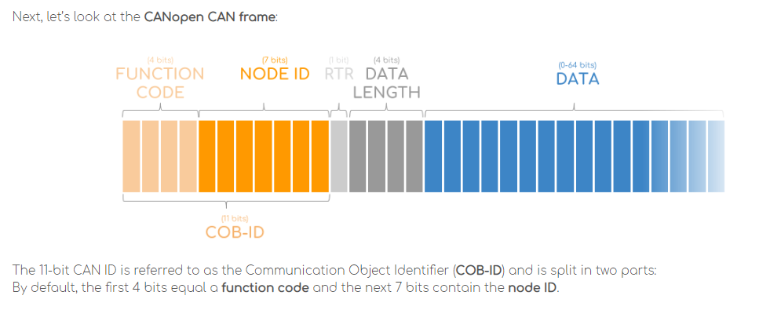
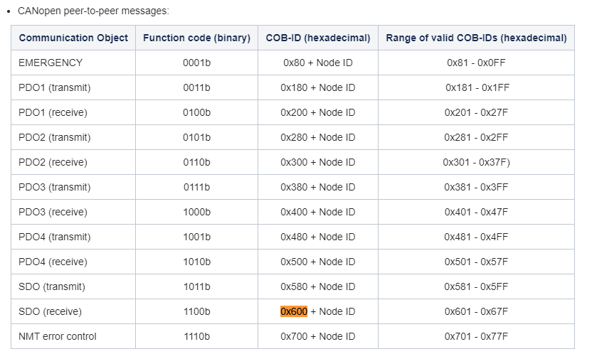

# STM32F446-CAN_BUS
STM32F446 reading voltage from RoboteQ MDC2460 brushed motor driver through CAN bus. 

The selected CAN Mode is : CANopen !

Some notes: The Can_Id of RoboteQ is 0x08 , to read the voltage from the driver you have to send 0x210D.

The frame that is sent is composend from the followings:

TxHeader.DLC = 8 => Data length = 8 bytes

TxHeader.StdId = 0x600 | 8 

In order to understand TxHeader.StdId, you need to understand how CANopen mode works.





The CAN1_TX and CAN1_RX is connected to a CAN tranceiver which in turn is connected to the driver.

See the Logic analyzer screenshot for more information. 

Move() function is not implemented in main.c. Its purpose is to send command to RoboteQ in order to rotate the motor in one direction
with a particular speed(-1000)

```c
void move()
{
	CAN_TxHeaderTypeDef TxHeader;
	uint32_t TxMailBox;
	uint8_t our_message[8] = {0x23, 0x2000 & 0xff, 0x2000>>8, 1, -1000, -2, 0, 0};
	//uint8_t our_message[5] = {'H','E','L','L','O'};
	TxHeader.DLC = 8;
	TxHeader.StdId = 0x600 | 8;
	TxHeader.IDE = CAN_ID_STD;
	TxHeader.RTR = 	CAN_RTR_DATA;  //request data

	if(HAL_CAN_AddTxMessage(&hcan1,&TxHeader,our_message,&TxMailBox) != HAL_OK)
	{
		Error_Handler();
	}

	while(HAL_CAN_IsTxMessagePending(&hcan1,TxMailBox));
}
```

The reason why the first data byte is 0x23 is because of the following :


